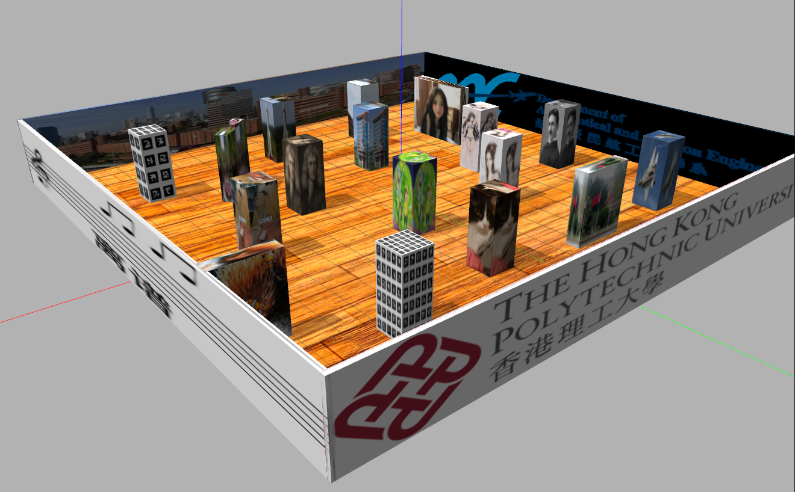
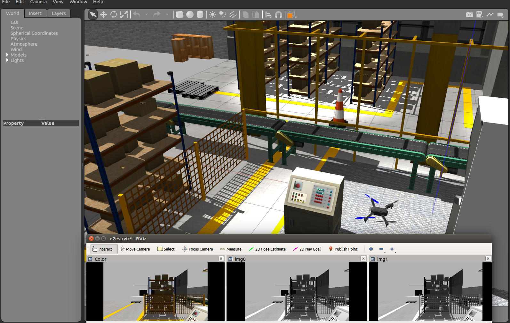

# E2ES
## End-to-End UAV Simulation for Visual SLAM and Navigation
### Introduction


This Kit provides an end to end simulation solution for MAV visual SLAM and path planning researches. <br />
In this work, several features are added to the default [PX4](https://github.com/PX4/Firmware) Gazebo Simulator: <br />
-A realsense D435 model (based on [realsense_gazebo_plugin](https://github.com/pal-robotics/realsense_gazebo_plugin)) <br />
-Modified IRIS MAV model <br />
-Several structured/unstructured simulation world <br />
-Keyborad control support <br />
The work has been verified on Ubuntu 18.04 + ROS melodic environment <br />
We strongly recommend to you to run this simulation with CUDA supported graphic card!

### Simulation environment

square_room: <br />



factory: <br />



# manual control
1: Take off------|---2: land <br />
Q: rotate left---|---W: forward----|--E: rotate right--|--R: up <br />
A: left----------|---S: backward---|--D: right---------|--F: down <br />

### Usage
Install pre-requires:
````
sudo apt-get install ros-melodic-mavros ros-melodic-mavros-extras ros-melodic-mavros-msgs libncurses5-dev python3-pip libgstreamer1.0-dev python-jinja2 python-pip python-testresources libignition-math2 libgazebo9-dev
pip3 install --user empy toml numpy packaging jinja2
pip install numpy toml empy packaging
sudo apt upgrade libignition-math2
wget https://raw.githubusercontent.com/mavlink/mavros/master/mavros/scripts/install_geographiclib_datasets.sh
sudo bash ./install_geographiclib_datasets.sh
````
If you fail to upgrade libignition-math2, try apt-get update and upgrade.

Downloadn and install the PX4 (1.11.0)
````
git clone https://github.com/PX4/PX4-Autopilot.git
cd PX4-Autopilot/
bash ./Tools/setup/ubuntu.sh
git checkout 71db090
git submodule sync --recursive
git submodule update --init --recursive
make px4_sitl_default gazebo
````

If you got errors, try following steps:
````
sudo make clean
DONT_RUN=1 make px4_sitl_default gazebo
sudo chmod 777 .gazebo/
````

add the following lines to bashrc:
````
source Tools/setup_gazebo.bash $(pwd) $(pwd)/build/px4_sitl_default
export ROS_PACKAGE_PATH=$ROS_PACKAGE_PATH:$(pwd)
export ROS_PACKAGE_PATH=$ROS_PACKAGE_PATH:$(pwd)/Tools/sitl_gazebo
````

Clone this repository to catkin src folder say: ~/catkin_ws/src
````
cd ~/catkin_ws/src
git clone https://github.com/HKPolyU-UAV/E2ES.git
````
Install 3rd Part Library
````
cd ~/catkin_ws/src/E2ES/3rdPartLib
sudo ./install3rdPartLib.sh
````
Compile
````
cd ~/catkin_ws/
catkin_make
````
By default **ROS_WORK_SPACE_PATH** is ~/catkin_ws and **PX4_Firmware_PATH** is ~/PX4-Autopilot <br />
If Not, Edit the path in E2ES/load_world_YOUR_MAP.sh script(Line 1 to 4)
````
export GAZEBO_RESOURCE_PATH=$GAZEBO_RESOURCE_PATH:~/catkin_ws/src/e2es/gazebo/YOUR_MAP
export GAZEBO_MODEL_PATH=$GAZEBO_MODEL_PATH:~/catkin_ws/src/e2es/gazebo/YOUR_MAP/models
export GAZEBO_PLUGIN_PATH=$GAZEBO_PLUGIN_PATH:~/catkin_ws/devel/lib
cd ~/PX4-Autopilot
````
to
````
export GAZEBO_RESOURCE_PATH=$GAZEBO_RESOURCE_PATH:ROS_WORK_SPACE_PATH/src/e2es/gazebo/YOUR_MAP
export GAZEBO_MODEL_PATH=$GAZEBO_MODEL_PATH:ROS_WORK_SPACE_PATH/src/e2es/gazebo/YOUR_MAP/models
export GAZEBO_PLUGIN_PATH=$GAZEBO_PLUGIN_PATH:ROS_WORK_SPACE_PATH/devel/lib
cd PX4_Firmware_PATH
````
Run the simulator
````
roscd e2es
./load_world_XXXX.sh
````
Using keyboard to control the MAV in simulator
````
roslaunch e2es UAV.launch
roslaunch e2es keyboard_ctr.launch
````

You can also use the 2D-Nav-Goal in RVIZ to publish your destination. <br />

# Testing your algorithms

Example: 

VO (https://github.com/arclab-hku/SOPVO) + tracking (https://github.com/arclab-hku/ICRA2021tracking): 


### Acknowledgement
This work are based on [PX4 Projcet](https://github.com/PX4/Firmware) and [realsense_gazebo_plugin](https://github.com/pal-robotics/realsense_gazebo_plugin)

### Maintainer
[Shengyang Chen](https://www.polyu.edu.hk/researchgrp/cywen/index.php/en/people/researchstudent.html)(Dept.ME,PolyU): shengyang.chen@connect.polyu.hk <br />
Han Chen(Dept.AAE,PolyU):stark.chen@connect.polyu and Ran Duan(Dept.AAE,PolyU):rduan036@gmail.com.
